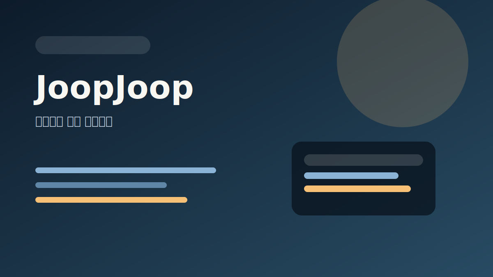
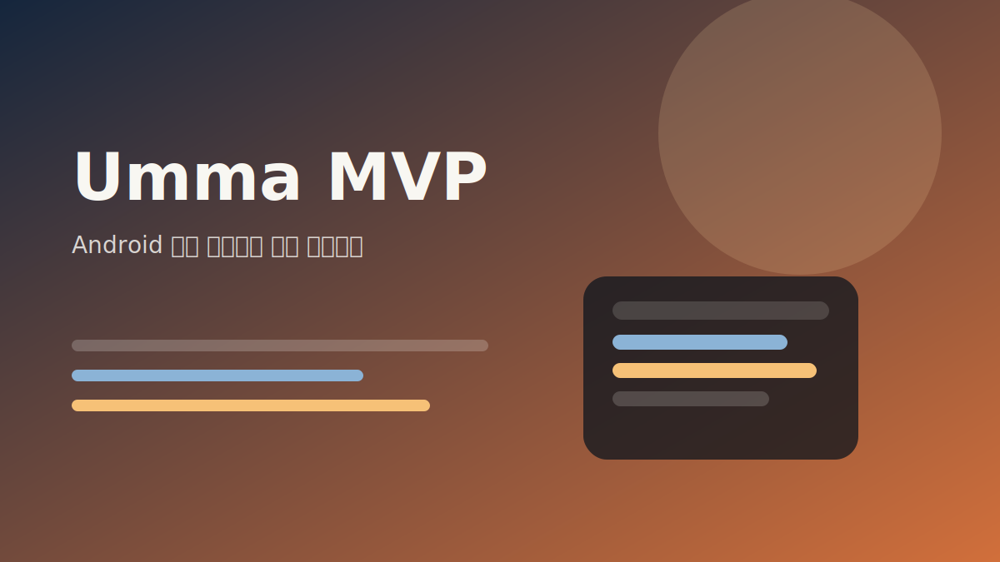
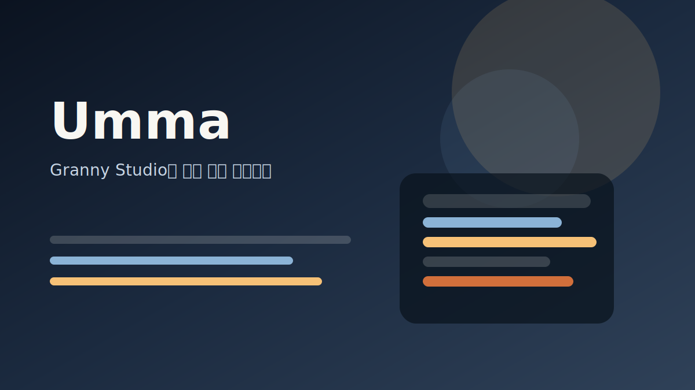

프로젝트별 기록을 모아두는 아카이브입니다. 각 프로젝트 페이지는 소개 문서가 아니라, 관련 개발일지와 트러블슈팅을 이어 붙이는 허브로 운영합니다.

<section class="granny-project-columns">
  

    

      Personal Projects
      <h2>학습과 실험의 기록</h2>
      
부트캠프와 개인 학습 과정에서 만든 프로젝트입니다. 완성도보다 성장 과정과 배운 점을 함께 보관합니다.

    

    

      <a class="granny-project-card" href="joopjoop/">
        
        

          Personal Project
          <strong>JoopJoop</strong>
          
부트캠프 중간 프로젝트

        

      </a>
      <a class="granny-project-card" href="umma-mvp/">
        
        

          Personal Project
          <strong>Umma MVP</strong>
          
Android 기반 부트캠프 최종 프로젝트

        

      </a>
    

  

  

    

      Granny Studio Projects
      <h2>제품으로 이어지는 기록</h2>
      
Granny Studio 이름 아래 장기적으로 발전시킬 프로젝트입니다. 프로젝트의 변화와 의사결정이 계속 연결됩니다.

    

    

      <a class="granny-project-card" href="umma/">
        
        

          Granny Studio Project
          <strong>Umma</strong>
          
현재 개발 중인 Flutter 기반 서비스

        

      </a>
      

        

          Future Project
          <strong>Future Projects</strong>
          
Granny Studio 아래에 추가될 다음 프로젝트를 위한 자리입니다.

        

      

    

  

</section>

  새 프로젝트가 생기면 이 페이지에 직접 링크를 추가하고, 개별 프로젝트 페이지에는 관련 글을 연결할 기준만 정리합니다. 자세한 개발 과정은 Journal과 Troubleshooting에 쌓습니다.

